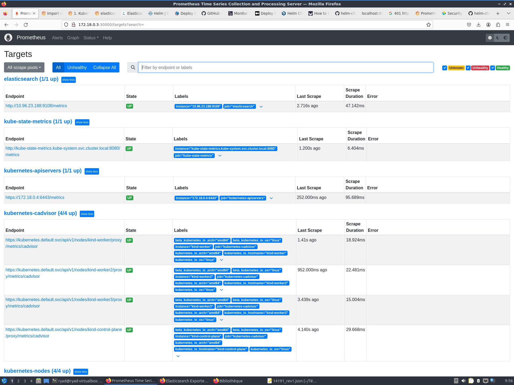
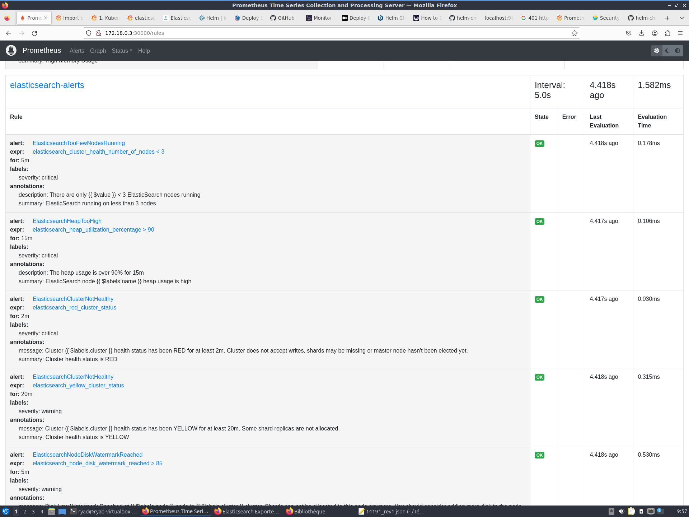
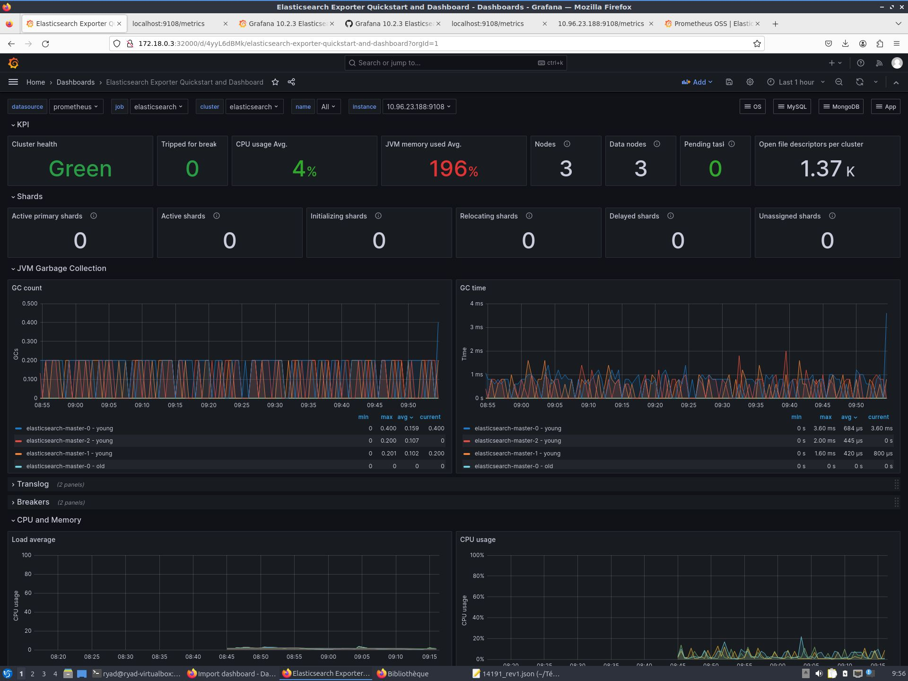

# Guide d'installation et de configuration pour un environnement de surveillance Kubernetes avec Prometheus, Grafana, Elasticsearch et Elasticsearch Exporter 
## 1. Install Prometheus 
### créer un namespace :
```bash
kubectl create namespace monitoring 
```
#### créer clusterRole.yaml:

```yaml
apiVersion: rbac.authorization.k8s.io/v1
kind: ClusterRole
metadata:
  name: prometheus
rules:
- apiGroups: [""]
  resources:
  - nodes
  - nodes/proxy
  - services
  - endpoints
  - pods
  verbs: ["get", "list", "watch"]
- apiGroups:
  - extensions
  resources:
  - ingresses
  verbs: ["get", "list", "watch"]
- nonResourceURLs: ["/metrics"]
  verbs: ["get"]
---
apiVersion: rbac.authorization.k8s.io/v1
kind: ClusterRoleBinding
metadata:
  name: prometheus
roleRef:
  apiGroup: rbac.authorization.k8s.io
  kind: ClusterRole
  name: prometheus
subjects:
- kind: ServiceAccount
  name: default
  namespace: monitoring

```
### exécuter le
```bash
kubectl create -f clusterRole.yaml
```
#### config-map.yaml: 

```yaml 
apiVersion: v1
kind: ConfigMap
metadata:
  name: prometheus-server-conf
  labels:
    name: prometheus-server-conf
  namespace: monitoring
data:
  prometheus.rules: |-
    groups:
    - name: devopscube demo alert
      rules:
      - alert: High Pod Memory
        expr: sum(container_memory_usage_bytes) > 1
        for: 1m
        labels:
          severity: slack
        annotations:
          summary: High Memory Usage
  prometheus.yml: |-
    global:
      scrape_interval: 5s
      evaluation_interval: 5s
    rule_files:
      - /etc/prometheus/prometheus.rules
    alerting:
      alertmanagers:
      - scheme: http
        static_configs:
        - targets:
          - "alertmanager.monitoring.svc:9093"
    scrape_configs:
      - job_name: 'node-exporter'
        kubernetes_sd_configs:
          - role: endpoints
        relabel_configs:
        - source_labels: [__meta_kubernetes_endpoints_name]
          regex: 'node-exporter'
          action: keep
      - job_name: 'kubernetes-apiservers'
        kubernetes_sd_configs:
        - role: endpoints
        scheme: https
        tls_config:
          ca_file: /var/run/secrets/kubernetes.io/serviceaccount/ca.crt
        bearer_token_file: /var/run/secrets/kubernetes.io/serviceaccount/token
        relabel_configs:
        - source_labels: [__meta_kubernetes_namespace, __meta_kubernetes_service_name, __meta_kubernetes_endpoint_port_name]
          action: keep
          regex: default;kubernetes;https
      - job_name: 'kubernetes-nodes'
        scheme: https
        tls_config:
          ca_file: /var/run/secrets/kubernetes.io/serviceaccount/ca.crt
        bearer_token_file: /var/run/secrets/kubernetes.io/serviceaccount/token
        kubernetes_sd_configs:
        - role: node
        relabel_configs:
        - action: labelmap
          regex: __meta_kubernetes_node_label_(.+)
        - target_label: __address__
          replacement: kubernetes.default.svc:443
        - source_labels: [__meta_kubernetes_node_name]
          regex: (.+)
          target_label: __metrics_path__
          replacement: /api/v1/nodes/${1}/proxy/metrics
      - job_name: 'kubernetes-pods'
        kubernetes_sd_configs:
        - role: pod
        relabel_configs:
        - source_labels: [__meta_kubernetes_pod_annotation_prometheus_io_scrape]
          action: keep
          regex: true
        - source_labels: [__meta_kubernetes_pod_annotation_prometheus_io_path]
          action: replace
          target_label: __metrics_path__
          regex: (.+)
        - source_labels: [__address__, __meta_kubernetes_pod_annotation_prometheus_io_port]
          action: replace
          regex: ([^:]+)(?::\d+)?;(\d+)
          replacement: $1:$2
          target_label: __address__
        - action: labelmap
          regex: __meta_kubernetes_pod_label_(.+)
        - source_labels: [__meta_kubernetes_namespace]
          action: replace
          target_label: kubernetes_namespace
        - source_labels: [__meta_kubernetes_pod_name]
          action: replace
          target_label: kubernetes_pod_name
      - job_name: 'kube-state-metrics'
        static_configs:
          - targets: ['kube-state-metrics.kube-system.svc.cluster.local:8080']
      - job_name: 'kubernetes-cadvisor'
        scheme: https
        tls_config:
          ca_file: /var/run/secrets/kubernetes.io/serviceaccount/ca.crt
        bearer_token_file: /var/run/secrets/kubernetes.io/serviceaccount/token
        kubernetes_sd_configs:
        - role: node
        relabel_configs:
        - action: labelmap
          regex: __meta_kubernetes_node_label_(.+)
        - target_label: __address__
          replacement: kubernetes.default.svc:443
        - source_labels: [__meta_kubernetes_node_name]
          regex: (.+)
          target_label: __metrics_path__
          replacement: /api/v1/nodes/${1}/proxy/metrics/cadvisor
      - job_name: 'kubernetes-service-endpoints'
        kubernetes_sd_configs:
        - role: endpoints
        relabel_configs:
        - source_labels: [__meta_kubernetes_service_annotation_prometheus_io_scrape]
          action: keep
          regex: true
        - source_labels: [__meta_kubernetes_service_annotation_prometheus_io_scheme]
          action: replace
          target_label: __scheme__
          regex: (https?)
        - source_labels: [__meta_kubernetes_service_annotation_prometheus_io_path]
          action: replace
          target_label: __metrics_path__
          regex: (.+)
        - source_labels: [__address__, __meta_kubernetes_service_annotation_prometheus_io_port]
          action: replace
          target_label: __address__
          regex: ([^:]+)(?::\d+)?;(\d+)
          replacement: $1:$2
        - action: labelmap
          regex: __meta_kubernetes_service_label_(.+)
        - source_labels: [__meta_kubernetes_namespace]
          action: replace
          target_label: kubernetes_namespace
        - source_labels: [__meta_kubernetes_service_name]
          action: replace
          target_label: kubernetes_name
```
```bash
kubectl create -f config-map.yaml
```
#### créer prometheus-deployment.yaml: 

```yaml
apiVersion: apps/v1
kind: Deployment
metadata:
  name: prometheus-deployment
  namespace: monitoring
  labels:
    app: prometheus-server
spec:
  replicas: 1
  selector:
    matchLabels:
      app: prometheus-server
  template:
    metadata:
      labels:
        app: prometheus-server
    spec:
      containers:
        - name: prometheus
          image: prom/prometheus
          args:
            - "--storage.tsdb.retention.time=12h"
            - "--config.file=/etc/prometheus/prometheus.yml"
            - "--storage.tsdb.path=/prometheus/"
          ports:
            - containerPort: 9090
          resources:
            requests:
              cpu: 500m
              memory: 500M
            limits:
              cpu: 1
              memory: 1Gi
          volumeMounts:
            - name: prometheus-config-volume
              mountPath: /etc/prometheus/
            - name: prometheus-storage-volume
              mountPath: /prometheus/
      volumes:
        - name: prometheus-config-volume
          configMap:
            defaultMode: 420
            name: prometheus-server-conf
  
        - name: prometheus-storage-volume
          emptyDir: {}

```
```bash
kubectl create  -f prometheus-deployment.yaml 
```
#### créer prometheus-service.yaml:

```yaml
apiVersion: v1
kind: Service
metadata:
  name: prometheus-service
  namespace: monitoring
  annotations:
      prometheus.io/scrape: 'true'
      prometheus.io/port:   '9090'
spec:
  selector: 
    app: prometheus-server
  type: NodePort  
  ports:
    - port: 8080
      targetPort: 9090 
      nodePort: 30000
```
```bash
kubectl create -f prometheus-service.yaml --namespace=monitoring
```
## 2. Setup Kube state metrics 
```bash
git clone https://github.com/devopscube/kube-state-metrics-configs.git
```
```bash
kubectl apply -f kube-state-metrics-configs/
```
```bash
kubectl get deployments kube-state-metrics -n kube-system
```
### il faut ajouter ensuite : 
```yaml
- job_name: 'kube-state-metrics'
  static_configs:
    - targets: ['kube-state-metrics.kube-system.svc.cluster.local:8080']
```

## 3. Set up grafana 
```bash
git clone https://github.com/bibinwilson/kubernetes-grafana.git
```
### edit grafana-datasource-config.yaml
```yaml
apiVersion: v1
kind: ConfigMap
metadata:
  name: grafana-datasources
  namespace: monitoring
data:
  prometheus.yaml: |-
    {
        "apiVersion": 1,
        "datasources": [
            {
               "access":"proxy",
                "editable": true,
                "name": "prometheus",
                "orgId": 1,
                "type": "prometheus",
                "url": "http://prometheus-service.monitoring.svc:8080",
                "version": 1
            }
        ]
    }
```
```bash
kubectl create -f grafana-datasource-config.yaml 
```
#### créer deployment.yaml:
```yaml
apiVersion: apps/v1
kind: Deployment
metadata:
  name: grafana
  namespace: monitoring
spec:
  rep<licas: 1
  selector:
    matchLabels:
      app: grafana
  template:
    metadata:
      name: grafana
      labels:
        app: grafana
    spec:
      containers:
      - name: grafana
        image: grafana/grafana:latest
        ports:
        - name: grafana
          containerPort: 3000
        resources:
          limits:
            memory: "1Gi"
            cpu: "1000m"
          requests: 
            memory: 500M
            cpu: "500m"
        volumeMounts:
          - mountPath: /var/lib/grafana
            name: grafana-storage
          - mountPath: /etc/grafana/provisioning/datasources
            name: grafana-datasources
            readOnly: false
      volumes:
        - name: grafana-storage
          emptyDir: {}
        - name: grafana-datasources
          configMap:
              defaultMode: 420
              name: grafana-datasources
```
```bash
kubectl create -f deployment.yaml 
```
#### créer service.yaml:
```yaml
apiVersion: v1
kind: Service
metadata:
  name: grafana
  namespace: monitoring
  annotations:
      prometheus.io/scrape: 'true'
      prometheus.io/port:   '3000'
spec:
  selector: 
    app: grafana
  type: NodePort  
  ports:
    - port: 3000
      targetPort: 3000
      nodePort: 32000
```
```bash
kubectl create -f service.yaml
```
```bash
kubectl port-forward -n monitoring <grafana-pod-name> 3000 &
```
User: admin
Pass: admin


## 4- install eslatic : 

### créer values.yaml 
```yaml
values.yaml :
antiAffinity: "soft"
esJavaOpts: "-Xmx128m -Xms128m"
resources:
  requests:
    cpu: "100m"
    memory: "512M"
  limits:
    cpu: "1000m"
    memory: "512M"

volumeClaimTemplate:
  accessModes: [ "ReadWriteOnce" ]
  storageClassName: "standard"
  resources:
    requests:
      storage: 100M

esConfig:
  elasticsearch.yml: |
    xpack.security.http.ssl.enabled: false
    xpack.security.authc:
      anonymous:
        username: anonymous_user
        roles: superuser
        authz_exception: true
```
```bash
helm repo add elastic https://helm.elastic.co
helm install elasticsearch elastic/elasticsearch -f values.yaml
```
## 5- Install Elasticsearch exporter 
```bash
clone https://github.com/prometheus-community/helm-charts/tree/main
cd charts/prometheus-elasticsearch-exporter 
```
### edit values.yaml :
```yaml
change sslSkipVerify to true 
and uri:  <proto>://<user>:<password>@<host>:<port> 
the user : elastic 
the password: kubectl get secrets --namespace=default elasticsearch-master-credentials -ojsonpath='{.data.password}' | base64 -d
```
### maintenant on modifie le cm de prometheus qu'on va ajouter
```yaml
- job_name: elasticsearch
  static_configs:
  - targets: ['elasticsearch_exporter_machine_IP_address:9108']
```



### ajouter les alerts dans le configmap de prometheus 
```yaml
- name: elasticsearch-alerts
  rules:
  - alert: ElasticsearchTooFewNodesRunning
    expr: elasticsearch_cluster_health_number_of_nodes < 3
    for: 5m
    annotations:
      description: "There are only {{ $value }} < 3 ElasticSearch nodes running"
      summary: ElasticSearch running on less than 3 nodes
    labels:
      severity: critical

  - alert: ElasticsearchHeapTooHigh
    expr: elasticsearch_heap_utilization_percentage > 90
    for: 15m
    annotations:
      description: The heap usage is over 90% for 15m
      summary: "ElasticSearch node {{ $labels.name }} heap usage is high"
    labels:
      severity: critical

  - alert: ElasticsearchClusterNotHealthy
    expr: elasticsearch_red_cluster_status
    for: 2m
    annotations:
      message: "Cluster {{ $labels.cluster }} health status has been RED for at least 2m. Cluster does not accept writes, shards may be missing or master node hasn't been elected yet."
      summary: Cluster health status is RED
    labels:
      severity: critical

  - alert: ElasticsearchClusterNotHealthy
    expr: elasticsearch_yellow_cluster_status
    for: 20m
    annotations":
      message": "Cluster {{ $labels.cluster }} health status has been YELLOW for at least 20m. Some shard replicas are not allocated."
      summary": Cluster health status is YELLOW
    labels:
      severity: warning

  - alert: ElasticsearchNodeDiskWatermarkReached
    expr: elasticsearch_node_disk_watermark_reached > 85
    for: 5m
    annotations:
      message: "Disk Low Watermark Reached at {{ $labels.node }} node in {{ $labels.cluster }} cluster. Shards can not be allocated to this node anymore. You should consider adding more disk to the node."
      summary: "Disk Low Watermark Reached - disk saturation is {{ $value }}%"
    labels:
      severity: warning

  - alert: ElasticsearchNodeDiskWatermarkReached
    expr: elasticsearch_node_disk_watermark_reached > 90
    for: 5m
    annotations:
      message: "Disk High Watermark Reached at {{ $labels.node }} node in {{ $labels.cluster }} cluster. Some shards will be re-allocated to different nodes if possible. Make sure more disk space is added to the node or drop old indices allocated to this node."
      summary: "Disk High Watermark Reached - disk saturation is {{ $value }}%"
    labels:
      severity: critical

  - alert: ElasticsearchJVMHeapUseHigh
    expr: elasticsearch_heap_utilization_percentage > 75
    for: 10m
    annotations:
      message: "JVM Heap usage on the node {{ $labels.node }} in {{ $labels.cluster }} cluster is {{ $value }}%."
      summary: JVM Heap usage on the node is high
    labels:
      severity: critical

  - alert: SystemCPUHigh
    expr: elasticsearch_os_cpu_high > 90
    for: 1m
    annotations":
      message: "System CPU usage on the node {{ $labels.node }} in {{ $labels.cluster }} cluster is {{ $value }}%"
      summary: System CPU usage is high
    labels:
      severity: critical

  - alert: ElasticsearchProcessCPUHigh
    expr: elasticsearch_process_cpu_high > 90
    for: 1m
    annotations:
      message: "ES process CPU usage on the node {{ $labels.node }} in {{ $labels.cluster }} cluster is {{ $value }}%"
      summary: ES process CPU usage is high
    labels:
      severity: critical
```

 


#### maintenant on ajoute les recording rules : 
```yaml
groups:
- name: elasticsearch_rules
  rules:
  - record: elasticsearch_filesystem_data_free_percent
    expr: 100 - elasticsearch_filesystem_data_used_percent

  - record: elasticsearch_red_cluster_status
    expr: sum by (cluster) (elasticsearch_cluster_health_status == 2)

  - record: elasticsearch_yellow_cluster_status
    expr: sum by (cluster) (elasticsearch_cluster_health_status == 1)

  - record: elasticsearch_process_cpu_high
    expr: sum by (cluster, instance, name) (elasticsearch_process_cpu_percent)

  - record: elasticsearch_os_cpu_high
    expr: sum by (cluster, instance, name) (elasticsearch_os_cpu_percent)

  - record: elasticsearch_filesystem_data_used_percent
    expr: sum by (cluster, instance, name) (
      100 * (elasticsearch_filesystem_data_size_bytes - elasticsearch_filesystem_data_free_bytes)
      / elasticsearch_filesystem_data_size_bytes)

  - record: elasticsearch_node_disk_watermark_reached
    expr: sum by (cluster, instance, name) (round(
          (1 - (elasticsearch_filesystem_data_available_bytes / elasticsearch_filesystem_data_size_bytes)
        ) * 100, 0.001))

  - record: elasticsearch_heap_utilization_percentage
    expr: sum by (cluster, instance, name) (
      100 * (elasticsearch_jvm_memory_used_bytes{area="heap"} / elasticsearch_jvm_memory_max_bytes{area="heap"}))
```
 


#### Dashboard Grafana
Enfin on importe ce [dashboard](https://grafana.com/api/dashboards/14191/revisions/1/download) sur grafana pour voir les metrics. 




